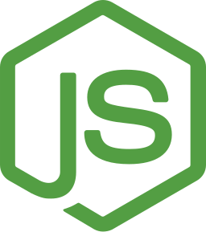
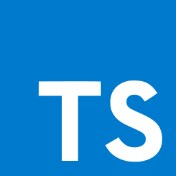
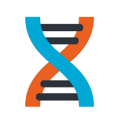
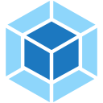
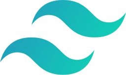
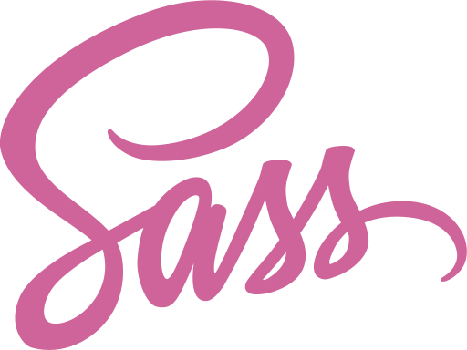
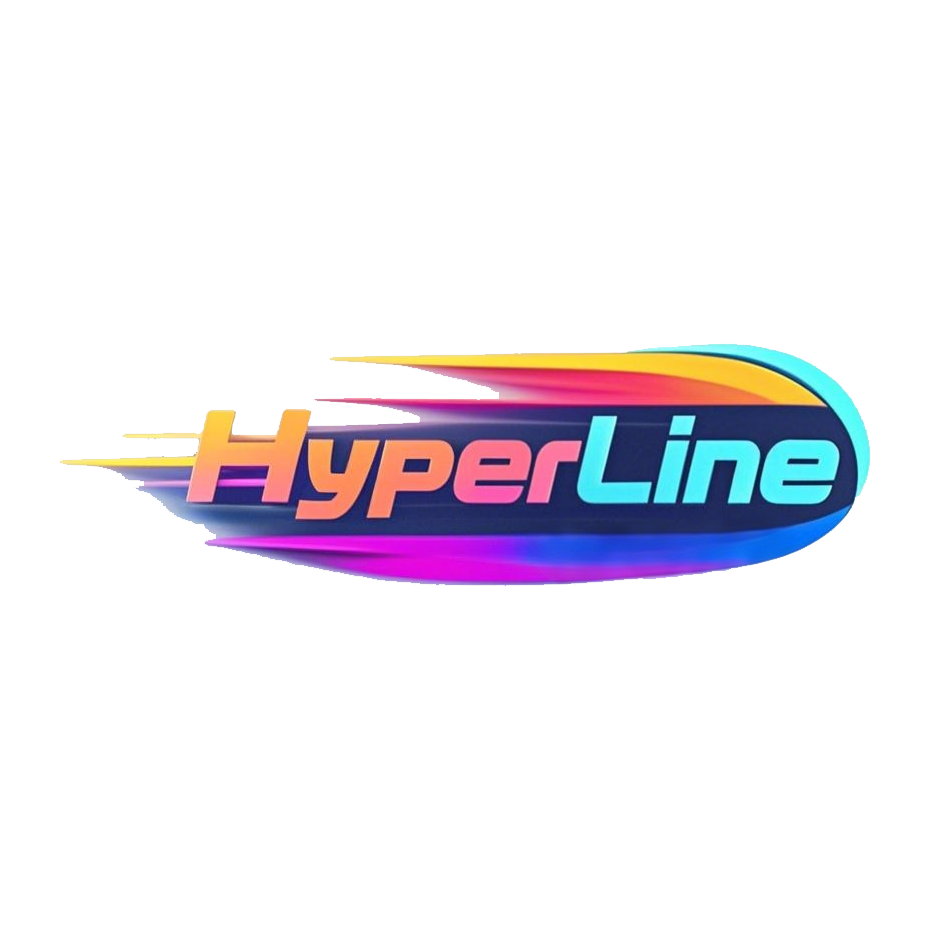

<h1>个人简介</h3>

<blockquote>
只要我们为人民的利益坚持好的，为人民的利益改正错的，我们这个队伍就一定会兴旺起来。
</blockquote>

<h3>社交主页</h3>

<a target="_blank" href="https://x.com/ltpp_universe" style="text-decoration:none"><code>X</code></a>
<a target="_blank" href="https://crates.io/users/eastspire" style="text-decoration:none"><code>Crates.io</code></a>

<h3>技术栈</h3>

<h4>编程语言</h4>

<h4>前端框架</h4>

<h4>前端工具</h4>

<h4>后端框架</h4>

